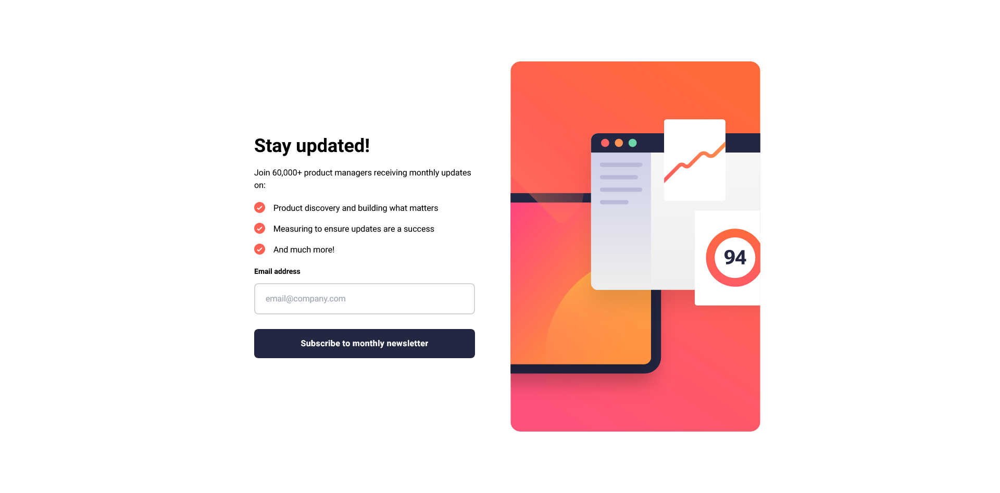

# Frontend Mentor - Newsletter sign-up form with success message solution

This is a solution to the [Newsletter sign-up form with success message challenge on Frontend Mentor](https://www.frontendmentor.io/challenges/newsletter-signup-form-with-success-message-3FC1AZbNrv). Frontend Mentor challenges help you improve your coding skills by building realistic projects. 

## Table of contents

- [Overview](#overview)
  - [The challenge](#the-challenge)
  - [Screenshot](#screenshot)
  - [Links](#links)
- [My process](#my-process)
  - [Built with](#built-with)
  - [What I learned](#what-i-learned)
  - [Continued development](#continued-development)
  - [Useful resources](#useful-resources)
- [Author](#author)

## Overview

### The challenge

Users should be able to:

- Add their email and submit the form
- See a success message with their email after successfully submitting the form
- See form validation messages if:
  - The field is left empty
  - The email address is not formatted correctly
- View the optimal layout for the interface depending on their device's screen size
- See hover and focus states for all interactive elements on the page

### Screenshot

### Links

- Solution URL: [Solution URL here](https://github.com/awesooomeME/newsletter_signup)
- Live Site URL: [Live site URL here](https://newsletter-signup-ten-alpha.vercel.app/)

## My process

### Built with

- Semantic HTML5 markup
- CSS custom properties
- Flexbox
- [React](https://reactjs.org/) - JS library
- [Next.js](https://nextjs.org/) - React framework
- [Tailwind](https://https://tailwindcss.com//) - For styles
- [Styled Components](https://styled-components.com/) - For styles

### What I learned

### Useful resources

- [resource 1](https://www.youtube.com/watch?v=tIdNeoHniEY&t=702s)
    - Great video for handling react forms and validations

- [resource 2](https://livebook.manning.com/book/next-js-in-action/welcome/v-2/) 
    - Great book for React introduction

- [resource 3](https://www.joshwcomeau.com/css/custom-css-reset/)
    - CSS Reset that I used

## Author

- Github - [awesooomeME](https://github.com/awesooomeME)
- Frontend Mentor - [@awesooomeME](https://www.frontendmentor.io/profile/awesooomeME)